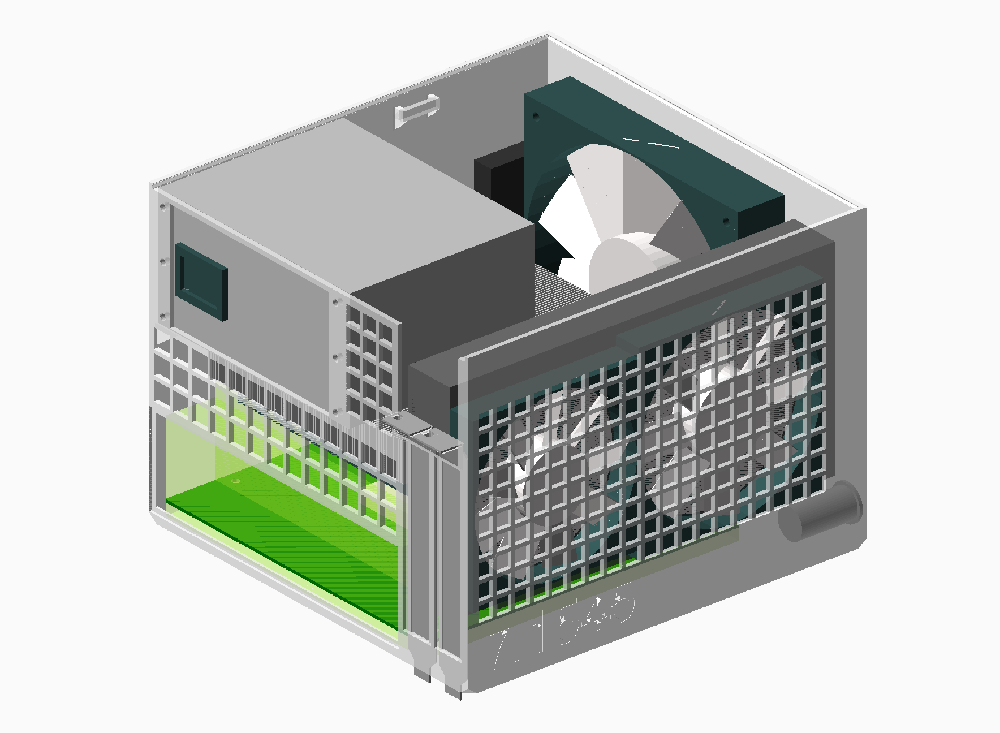

# Parametric Case
A, open source 3D printable PC case that can fit your components exactly by adjusting a few parameters.

by Nirav Patel http://eclecti.cc

# License
See LICENSE

# Instructions
The case is fully built out in OpenSCAD, an open source parametric modeling tool http://www.openscad.org/

You can generate printable stl files from that quickly by adjusting a few parameters to match your components.

If you happen to own the same components as I do (Noctua NH-L12s, Zotac 1080 Mini, SFX PSU), you can also just
use the example stl files directly.

## Parameters to edit
You'll need to choose the power supply type (psu_type of "sfx", "sfx-l", or "flexatx), the CPU heatsink
(heatsink_type of "aio", "noctua_nh_l12s", "noctua_nh_u9s", "cryorig_c7", or create your own), and probably measure
your GPU if you don't happen to own the Zotac 1080 Mini like I do.

    traditional(show_body = true, show_lid = false, show_internals = false, heatsink_type = "noctua_nh_l12s", psu_type = "sfx");

Beyond that, there are a range of optional items you can adjust.
 * The front fan with case_fan_size and case_fan_thickness
 * Ventilation for the m2 slot on your motherboard with m2_location
 * Extra clearance for your gpu power plug if needed with gpu_power_height
 * Airflow clearance for your heatsink if you want more than the default 5mm with cpu_fan_clearance
 * Thickness of all walls with wall in defaults.scad
 
## Printing
You'll need to print the body and the lid one at a time.  Note that the case is likely going to push up to or past
the size limits of many consumer 3d printers.  I've been printing them pretty successfully on a Prusa i3 MK3.

The case should print without any support required except for on the back panel around the motherboard i/o and power supply.
Cura allows you to block out support generation in other areas, and I assume other slicers do as well.

The default wall thickness with 20% infill should be more than stong enough, but you can adjust it up or down if needed.

I've found each case to require around 350-400g of filament, so be prepared for that.  You'll also want to make sure your
printer is outputting dimensionally correct prints, otherwise you're going to have a challenging time with assembly.

If you want the anti-vibration feet to actually anti-vibrate, you should print those with TPU or similar.

## Assembly
I use 5mm diameter M3 brass threaded inserts rather than screwing directly into the plastic for the motherboard and GPU.
Using a soldering iron with a blunt tip, you can heat press the insert into the plastic pretty easily.  Beyond that, you'll
want M3 screws, fan screws for your fan, and also #6-32 screws for your power supply.

Since the case is bucket shaped, you'll want to plug as many cables as you can into your motherboard outside
of the case and then drop the fully loaded motherboard down into the case.  After screwing the motherboard into the
threaded inserts, you can install the power supply and the GPU.

## Advanced editing
I only have the traditional "shoebox" style architecture built out, but all of the building blocks are in place to easily
build non-traditional case layouts.  You'll want to double check a lot of the dimensions though, especially around the GPU.

I strongly suspect there are still bugs all around, especially on the PCI bracket.  Pull requests are welcome.
